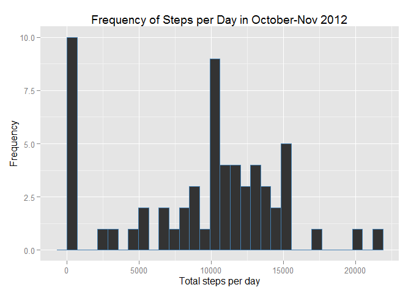
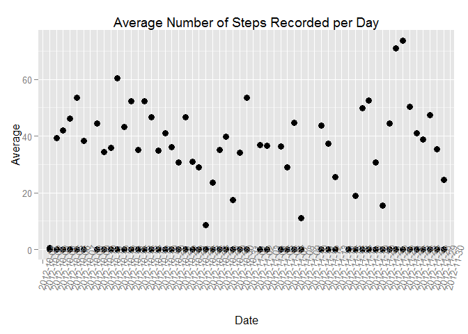
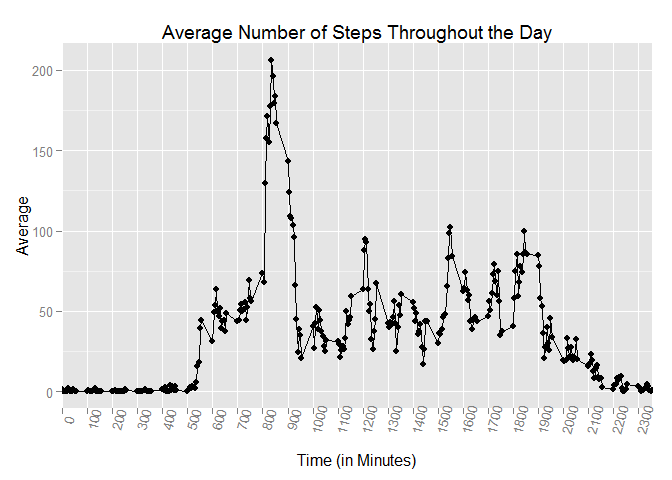
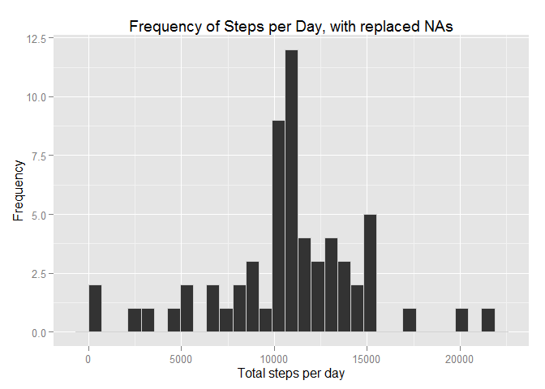
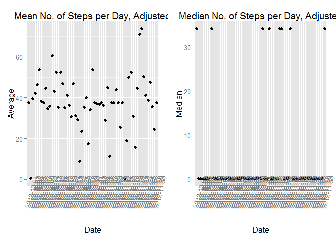
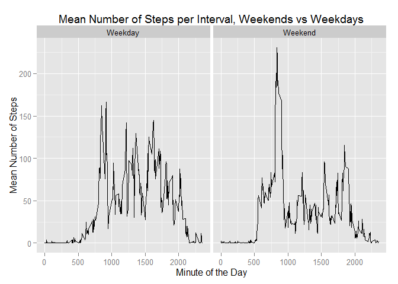
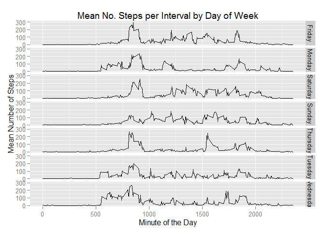

# Reproducible Research: Peer Assessment 1

This document analyzes data from a fitness activity monitoring device.
The data contains the number of steps taken by an anonymous individual during the months of October and November 2012, in 5 minute intervals.

This markdown file assumes user is already in working directory.

## Loading and preprocessing the data

First, load the requisite packages in R. 
Then, download the data from the internet and unzip it.


```r
library(dplyr)
```

```
## 
## Attaching package: 'dplyr'
## 
## The following object is masked from 'package:stats':
## 
##     filter
## 
## The following objects are masked from 'package:base':
## 
##     intersect, setdiff, setequal, union
```

```r
library(knitr)
library(ggplot2)
library(gridExtra)
```

```
## Loading required package: grid
```

```r
download.file("http://d396qusza40orc.cloudfront.net/repdata%2Fdata%2Factivity.zip","act.zip") 
#removed the s from http because knitr wouldn't run with it
unzip("act.zip")
data <- read.csv("activity.csv")
```

## What is mean total number of steps taken per day?

To get a sense of the data, the sum of total steps per day was calculated, as can be seen in the following graph. 
A histogram was created of the frequency of number of steps taken in a day.


```r
by_date <- group_by(data,date)
total_steps <- summarize(by_date,total=sum(steps,na.rm=TRUE))
#print(total_steps)

#The following graph is not really necessary
s <- ggplot(total_steps,aes(date,total,group=1))+
     geom_point(size=3)+
     geom_line(,size=.5)+
     theme_gray()+
     theme(axis.text.x=element_text(angle=80))+
     ggtitle("Total Number of Steps Recorded per Day")+
     scale_x_discrete(
          c("2012-10-01",
            "2012-10-15",
            "2012-10-31",
            "2012-11-15",
            "2012-11-30"))
#my efforts to only display some x axis tick labels have all failed.
print(s)
```

 

```r
h <- ggplot(total_steps,aes(total))+
     geom_histogram(color="steelblue")+
     theme_gray()+
     ylab("Frequency")+
     xlab("Total steps per day")+
     ggtitle("Frequency of Steps per Day in October-Nov 2012")
print(h)
```

 

From this data, the mean and median number of steps for each day can be calculated.

```r
mean_steps <- summarize(by_date,Average=mean(steps,na.rm=TRUE),group=1)
median_steps <- summarize(by_date,Average=median(steps,na.rm=TRUE),group=2)#actually median

#for ease of graphing on same plot
meanmed <- rbind(mean_steps,median_steps)

ms <- ggplot(meanmed,aes(date,Average),col=group)+
     geom_point(size=3)+
     #geom_line(,size=.5)+
     xlab("Date")+
     #tilt the tick labels so they don't run together so much
     theme(axis.text.x=element_text(angle=75))+
     ggtitle("Average Number of Steps Recorded per Day")
#my efforts to only display some x axis tick labels have all failed
print(ms)
```

```
## Warning in loop_apply(n, do.ply): Removed 16 rows containing missing
## values (geom_point).
```

 

```r
#This looks a bit strange, needs checking
```


The mean and median steps-per-day for both months overall was also calculated.

```r
#This part was not required in the assignment
overall_mean <- mean(total_steps$total)
print(overall_mean)
```

```
## [1] 9354.23
```

```r
median <- median(total_steps$total)
print(median)
```

```
## [1] 10395
```

## What is the average daily activity pattern?

```r
by_interval <- data %>% group_by(interval)
by_interval <- summarize(by_interval, Average=mean(steps,na.rm=TRUE))
#print(by_interval)

day_int <- ggplot(by_interval,aes(interval,Average,group=1))+
     geom_point(size=2)+
     geom_line(,size=.5)+
     xlab("Time (in Minutes)")+
     ggtitle("Average Number of Steps Throughout the Day")+
     theme(axis.text.x=element_text(angle=75))+
     scale_x_discrete(breaks=seq(0,2350,by=100))
print(day_int)
```

 

The Maximum value of average number of steps during any 5 minute period during the day, as can be seen from the graph, is at an interval in the 800-some minutes. The actual calculation is below:


```r
by_interval[which.max(by_interval$Average),]
```

```
## Source: local data frame [1 x 2]
## 
##   interval  Average
## 1      835 206.1698
```

## Inputing missing values

First, the total number of NA values recorded during the entire 2 month period is calculated. 

```r
numNAs <- sum(is.na(data$steps))
print(numNAs)
```

```
## [1] 2304
```


So, out of the 17568 data points, 2304 are NAs. To create a new dataset without NAs, the NAs will be replaced by the mean (over the 2 month interval) for that 5-minute interval.

The original dataframe was copied and the position of the NA values identified. They were then replaced using a for loop.

```r
#Create a list of positions of NA values
NAs <- which(is.na(data$steps))

#Copy the dataframe into a new dataframe
filled_data <- data

for(i in NAs){
     #Find the mean for that interval
     index <- which(filled_data$interval[i]==by_interval$interval)
     new_mean <- by_interval$Average[index]
     
     #replace the NA value with the mean for that interval
     filled_data$steps[i] <- new_mean 
}

#check <- which(is.na(filled_data$step))
#check
```
With this new dataframe, a histogram was made of steps taken each day.


```r
fill_by_date <- group_by(filled_data,date)
filled_hist <- summarize(fill_by_date,Total=sum(steps))

fh <- ggplot(filled_hist,aes(Total))+
     geom_histogram(color="lightgray")+
     ylab("Frequency")+
     xlab("Total steps per day")+
     ggtitle("Frequency of Steps per Day, with replaced NAs")
print(fh)
```

 

Calculate and report the mean and median total number of steps taken per day. Do these values differ from the estimates from the first part of the assignment? What is the impact of inputing missing data on the estimates of the total daily number of steps?

With this adjusted data, the mean and median number of steps for each day was re-calculated.

```r
fmean <- summarize(fill_by_date,Average=mean(steps))
fmedian <- summarize(fill_by_date,Median=median(steps))

fms <- ggplot(fmean,aes(date,Average),group=1)+
     geom_point(size=2)+
     geom_line(size=.5)+
     xlab("Date")+
     #tilt the tick labels so they don't run together so much
     theme(axis.text.x=element_text(angle=75))+
     ggtitle("Mean No. of Steps per Day, Adjusted")

fmds <- ggplot(fmedian,aes(date,Median),group=2)+
     geom_point(size=2)+
     geom_line(size=.5)+
     xlab("Date")+
     #tilt the tick labels so they don't run together so much
     theme(axis.text.x=element_text(angle=75))+
     ggtitle("Median No. of Steps per Day, Adjusted")
     
grid.arrange(fms,fmds,ncol=2)
```

 

```r
#Check these again
```

The adjusted mean and median steps-per-day for both months overall was also calculated.

```r
foverall_mean <- mean(filled_hist$Total)
print(foverall_mean)
```

```
## [1] 10766.19
```

```r
fmedian <- median(filled_hist$Total)
print(fmedian)
```

```
## [1] 10766.19
```


## Are there differences in activity patterns between weekdays and weekends?

To determine how activity patterns differ by day of the week, new groups were created in the adjusted data. First, the day of the week corresponding to the date was found, after converting the date column to a recognized date object. Then, dates were designated "Weekends" or "Weekdays". 

```r
#Add a column with the day of the week
filled_data$date <- as.POSIXct(filled_data$date,format="%Y-%m-%d")
filled_data <- mutate(filled_data,Day=weekdays(date))

#Make a column grouping weekdays and weekends
Group <- c() #Null
for(i in 1:nrow(filled_data)){
     if(filled_data$Day[i] %in% c("Monday",
                              "Tuesday",
                              "Wednesday",
                              "Thursday",
                              "Friday")){
          Group[i] <- "Weekend"  
     }else {
          Group[i] <- "Weekday"
     }
}
filled_data <- cbind(filled_data,Group)
```


Two graphs were generated, one that shows activity pattern weekends versus weekdays, and another, more detailed, per day of the week.

```r
#First graph: group by weekend/weekday
wkend <- group_by(filled_data,Group,interval)
wkend <- summarize(wkend,Average=mean(steps))

wk <- ggplot(wkend,aes(interval,Average),type="l")+
     facet_grid(.~ Group)+
     geom_line()+
     xlab("Minute of the Day")+
     ylab("Mean Number of Steps")+
     ggtitle("Mean Number of Steps per Interval, Weekends vs Weekdays")
print(wk)
```

 

```r
#Second graph is not required by assignment: per day of the week
by_dayname <- group_by(filled_data,Day,interval)
by_dayname <- summarize(by_dayname, Average=mean(steps))

dn <- ggplot(by_dayname,aes(interval, Average))+
     geom_line()+
     facet_grid(Day ~ .)+
     xlab("Minute of the Day")+
     ylab("Mean Number of Steps")+
     ggtitle("Mean No. Steps per Interval by Day of Week")
     #Should reorganize order of the legend and change the colors

print(dn)
```

 
